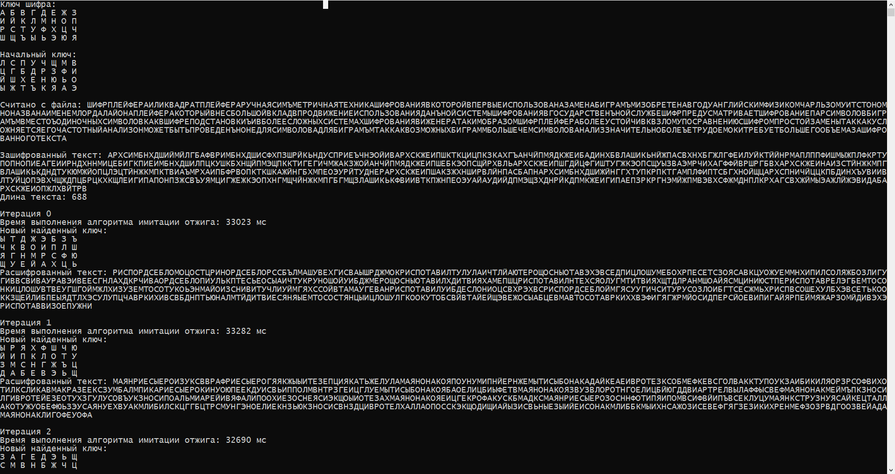
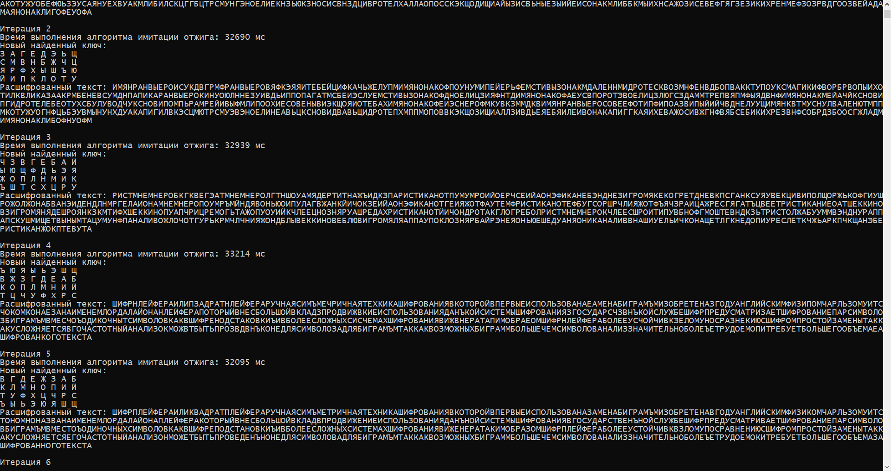
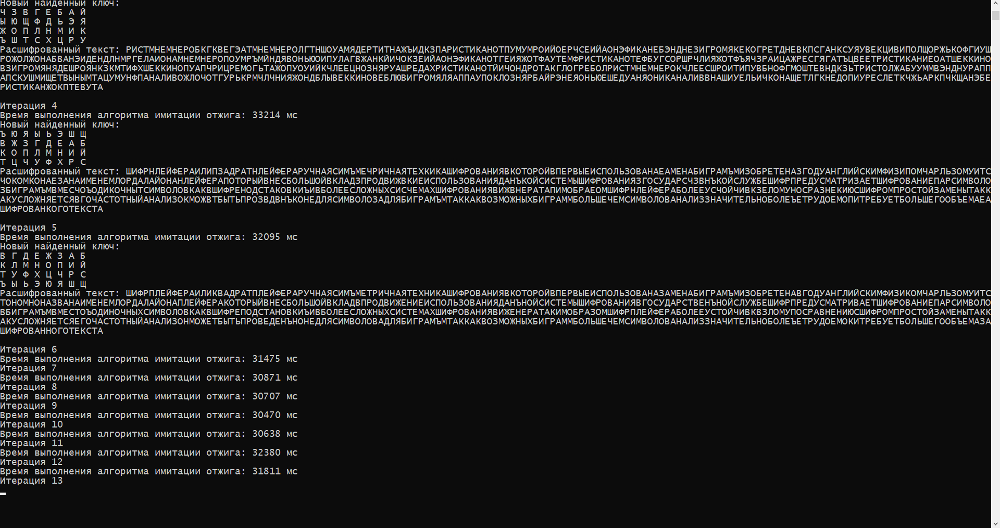

# Шифр плейфера - исследование и криптоанализ

## Содержание
1. [Описание шифра](#cipher_description)
1. [Криптоанализ](#cryptanalysis)
  a. [Алгоритм восхождения к вершине](#hill_climbing)
  b. [Алгоритм имитации отжига](#annealing_algorithm)
  c. [Измерение коэффициента соответствия](#measuring_fitness)
1. [Результаты](#results)
1. [Использование](#usage)
1. [Материалы](#materials)
 
## <a name="cipher_description" />Описание шифра
Шифр Плейфера - это подстановочный шифр, 
основанный на замене биграмм. Для его использования необходимо
сначала создать ключ шифра. Им является матрица обычно размера 4х8 для русского
алфавита(для английского используется матрица 5х5). Создается 
такая матрица очень просто. Нужно использовать ключевое слово и 
буквами из этого слова заполнить матрицу неповторяющимися символами.
Далее в пустые ячейки матрицы записать оставшийся алфавит. Рассмотрим
на примере. 

Алфавит - "АБВГДЕЖЗИЙКЛМНОПРСТУФХЦЧШЩЪЫЬЭЮЯ"

Ключевое слово - "ГАММА". 

Тогда наш ключ примет следующий вид:

|Г|А|М|Б|В|Д|Е|Ж|
||
|**З**|**И**|**Й**|**К**|**Л**|**Н**|**О**|**П**|
|**Р**|**С**|**Т**|**У**|**Ф**|**Х**|**Ц**|**Ч**|
|**Ш**|**Щ**|**Ъ**|**Ы**|**Ь**|**Э**|**Ю**|**Я**|

Допустим, мы хотим зашифровать сообщение "СИММЕТРИЧНОЕ ШИФРОВАНИЕ"
Для того, чтобы зашифровать сообщение, текст необходимо разбить
на биграммы. 

СИ ММ ЕТ РИ ЧН ОЕ ШИ ФР ОВ АН ИЕ

Если в биграмме оба символа совпадают или если остался один символ,
после первого необходимо
вставить разделяющую букву, к примеру 'Ъ'. В нашем примере
биграмма ММ содержит одинаковые буквы, значит нужно вставить между
ними 'Ъ'.

СИ МЪ МЕ ТР ИЧ НО ЕШ ИФ РО ВА НИ Е

Видим, что последняя буква осталась без пары. Добавим ей в компанию
твердый знак.

СИ МЪ МЕ ТР ИЧ НО ЕШ ИФ РО ВА НИ ЕЪ

Готово! Теперь можно приступать к шифрованию.

Правила шифрования

1. Если символы биграммы встречаются в ключе в одной строке, нужно
заменить их на следующие символы, находящиеся в этой же строке матрицы.
Строка воспринимается как циклическая, т.е. последний символ заменяется 
на первый.
2. Аналогично, если символы биграммы встречаются в ключе в одном столбце, нужно
заменить их на следующие символы, находящиеся в этом же столбце матрицы.
Столбец воспринимается как циклический, т.е. последний символ столбца заменяется 
на первый.
3. Если символы биграммы встречаются в разных строках и столбцах, то нужно заменить
их на соответствующие диагональные символы матрицы.

Рассмотрим на примере.

|Г|А|М|Б|В|Д|Е|Ж|
||
|**З**|**И**|**Й**|**К**|**Л**|**Н**|**О**|**П**|
|**Р**|**С**|**Т**|**У**|**Ф**|**Х**|**Ц**|**Ч**|
|**Ш**|**Щ**|**Ъ**|**Ы**|**Ь**|**Э**|**Ю**|**Я**|

Биграмма "СУ" заменяется на "ТФ"

"ЖЕ" на "ГЖ"

"ЕЖ" на "ЖГ"

"АС" на "ИЩ"

"ЯЖ" на "ЖП"

"ГЯ" на "ЖШ"

"ФБ" на "УВ"

Используя вышеперечисленные правила, после шифрования 

СИ МЪ МЕ ТР ИЧ НО ЕШ ИФ РО ВА НИ ЕЪ

получим

ЩС ЙМ БЖ УС ПС ОП ГЮ ЛС ЦЗ ДМ ОЙ МЮ

## <a name="cryptanalysis" />Криптоанализ

Для криптоанализа мы _могли бы_ использовать [алгоритм восхождения к вершине:][1]

### <a name="hill_climbing" /> Алгоритм восхождения к вершине
```
1. Сгенерируем случайный ключ test_key, с помощью которого расшифруем наше сообщение.
Далее для расшифрованного текста найдем коэффициент соответствия fitness и сохраним его.

2. Слегка изменим ключ, например, поменяем местами 2 случайные буквы или 2 строки.
С помощью нового ключа опять расшифруем текст и посчитаем коэффициент соответствия. 

3. Если наш коэффициент больше того, который измерен ранее, обновим fitness 
и наш ключ test_key.
```

У этого алгоритма есть существуенный недостаток - он будет застревать в точках локального
максимума. Мы можем достигнуть определенного ключа, который нельзя будет изменить таким 
образом, чтобы коэффициент соответствия увеличился, однако этого можно было бы достичь изменив
ключ с меньшим коэффициентом. Поэтому такой алгоритм нам не подходит и мы будем использовать
слегка модифицированную его версию. Этот алгоритм носит название
[алгоритм имитации отжига:][2]

### <a name="annealing_algorithm" /> Алгоритм имитации отжига
```
1. Сгенерируем случайный ключ test_key, с помощью которого расшифруем 
наше сообщение. Зададим ITERATIONS значение равное 10000

2. Заведем переменную fitness для хранения текующго коэффициента соответствия 
и max_fitness для хранения максимального. Также объявим max_key для хранения 
лучшего ключа. Для расшифрованного текста найдем коэффициент соответствия 
и запишем его в max_fitness.

3. for(temperature = 20; temperature >= 0; temperature -= TEMPERATURE_STEP)
     for(iteration=0; iteration < ITERATIONS; iteration++)
          Слегка изменим ключ 'test_key', например, поменяем местами 2 случайные
          буквы или 2 строки.
          С помощью нового ключа расшифруем текст и посчитаем коэффициент 
          соответствия. 
          Посчитаем, наскоолько отличается найденный коэффициент от максимального 
          fitness_difference = fitness - max_fitness.
          Если разница fitness_difference больше 0, обновим max_key, max_fitness.
          Если меньше 0(т.е. новый найденный ключ хуже test_key), вернемся к 
          худшему варианту и обновим max_key и max_fitness 
          с вероятностью e^(fitness_difference / temperature)

4. Будем повторять шаги 2-3, пока расшифрованный текст не станет читаемым.
```

Алгоритм имитации отжига очень похож на алгоритм восхождения к вершине, однако мы не можем
застрять в точке локального максимума. Если мы окажемся в такой точке, то с определенной 
вероятностью можем откатиться к худшему ключу и попробовать изменить его таким образом, чтобы 
коэффициент соответствия получился больше, чем в точке локального максимума. Таким образом, мы 
с большой вероятьностью сможем
правильно расшифровать текст. 

Откат к худшему варианту будет происходить с вероятностью $$ e^(fitness_difference / temperature). $$
Алгоритм имитации отжига имитирует реальный физический процесс, происходящий при кристаллизации
вещества и в том числе, при отжиге металлов(поэтому и был так назван). 
Атомы уже выстроились в кристаллическую решётку, но ещё допустимы переходы 
отдельных атомов из одной ячейки в другую. Сам процесс происходит
при понижающейся температуре, что как раз имитируется с помощью цикла 
`for(temperature = 20; temperature >= 0; temperature -= TEMPERATURE_STEP)`. Переход атомов 
происходит с некоторой вероятностью, которая будет уменьшаться вместе с понижением температуры.
В нашем случае переход атомов это и есть изменение ключа.

Теперь рассмотрим поведение функции $$ e^(fitness_difference / temperature). $$ Помните, что
значение `fitness_dirrerence` меньше 0.

|Значение переменной|Значение $$ e^(fitness_difference / temperature) $$ |
|||
|Значение `fitness_difference` большое по модулю|Стремится к 0|
|`fitness_difference` стремится к 0|Стремится к 1|
|Значение `temperature` большое|Стремится к 1|
|Значение `temperature` маленькое|Стремится к 0|

Следовательно, мы будет откатываться чаще, если разница между коэффициентами будет минимальной 
либо если значение `temperature` будет большим(т.е. мы будем находиться на начальных 
итерациях алгоритма).

### <a name="measuring_fitness" />Измерение коэффициента соответствия

Чтобы понять, насколько расшифрованный текст соответствует реальному, необходимо
посчитать коэффициент соответствия. Как мы будем это делать? Мы будем анализировать статистику квадграмм(последовательность из 4
символов). 
В файле `quadgramm_ru.txt` описаны все встречающиеся квадграммы и частоты их появления.
Для того, чтобы рассчитать вероятность появления в тексте какой-либо фразы, необходимо умножить 
между собой все вероятности появления квадрамм. Например, чтобы посчитать вероятность появления
в тексте слова `ДРАКОН`, нужно умножить вероятности появления всех квадграмм, составляющих слово:
`ДРАК`, `РАКО` и `АКОН`.

$$ p(ДРАКОН) = p(ДРАК) * p(РАКО) * p(АКОН) $$

Отмечу, что сами по себе вероятности появления квадграмм являются очень маленькими по значению и если
мы перемножим несколько таких вероятностей, то результатом будет значение с большим количеством
знаков после запятой. Чтобы хранить такое значечние, нам не хватит ни типа _double_, ни уж тем более
типа _float_. По этой причине мы будем использовать не сами вероятности p, а их логарифм $$ log(p), $$ тогда сами значения
будут в пределах ~от -50 до 0. 

Вспомним их курса школьной математики, что $$ log(a*b) = log(a) + log(b) $$ . Получим: 

$$ log(p("ДРАКОН")) = log(p("ДРАК") * p("РАКО") * p("АКОН")) $$

$$ log(p("ДРАКОН")) = log(p("ДРАК")) + log(p("РАКО")) + log(p("АКОН")) $$

Это значение и будет являться коэффициентом соответствия. Чем больше он будет, тем больше
текст будет похож на реальный текст, написанный на русском языке. Этим мы и будем
пользоваться при расшифровке текста, ведь если мы в результате расшифровки мы получим
нечитаемый набор букв, то и коэффициент соответствия будет маленьким. Следовательно,
мы будем искать ключ, который нам даст большее значение коэффициента.

При анализе, можно использовать биграммы и триграммы, однако значение коэффициента получается
более точным, если использовать квадграммы, поэтому их использование является оптимальным.

## <a name="results" />Результаты

На каждой итерации выполняем алгоритм имитации отжига, ища новый ключ, дающий лучшее
соответствие. Как можно заметить итерации 0-1 не дали нужного нам результата - 
расшифрованный текст пока остается нечитаемым.


Итерации 2-4 также не дали нам нужного результата, но можно заметить что на 4 итерации
некоторые слова уже можно разобрать.



На 5 итерации мы нашли ключ, с помощью которого успешно расшифровали сообщение. Дальшейшие
итерации проходят впустую, т.к. уже нельзя найти ключ, дающий лучший коэффициент.
Расшифровка сообщения окончена.



Стоит отметить, что сам алгоритм носит эвристический характер, т.е. в большинстве случаев
он действительно может расшифровать сообщение, однако может произойти так, что нужный
нам ключ вообще не будет найден. Также один и тот же текст можно правильно расшифровать
с помощью разных ключей, так что нельзя гарантировать нахождение именно того ключа, с 
помощью которого был изначально зашифрован текст. 

Для расшифровки нужно использовать большое по объему сообщение(от 100-150 символов) 
для корректного частотного анализа квадграмм. Также количество итераций `ITERATIONS` в 
алгоритме имитации отжига напрямую влияет на результат расшифровки - чем больше значение,
тем больше вероятность нахождения правильного решение, однако программа будет работать 
значительно дольше. Значение `TEMPERATURE_STEP` аналогично, чем оно меньше, тем больше
будет итераций в алгоритме и тем дольше будет работать программа. Начальное значение
температуры `TEMPRATURE` тоже играет большую роль и должно выбираться в зависимости от
объема зашифрованного текста(чем длиннее текст, тем больше должна быть начальная
температура). В любом случае для разных текстов все вышеперечисленные значения должны 
выбираться самостоятельно, поэтому Вам стоит самим с этим поэкспериментировать.

## <a name="usage" />Использование

Генерирование ключа по заданному слову:
```c++
wchar_t alphabet[] = L"АБВГДЕЖЗИЙКЛМНОПРСТУФХЦЧШЩЪЫЬЭЮЯ";
wchar_t cipher_key[ELEMENTS + 1];
generate_key(keyword_path, alphabet, cipher_key);
```

Шифрование/дешифрование текста по заданному ключу.
Для шифрования исползуется константа `ENCRYPTION_OFFSET`, для 
дешифрования - `DECRYPTION_OFFSET`.
```c++
playfair_cipher(text_to_encrypt, text_len, 
    cipher_key, encrypted_text, ENCRYPTION_OFFSET);
```

Основной алгоритм для криптоанализа описан в функции `main():`
```c++
double fitness = 0;
double max_fitness = -99999999;
wchar_t *decrypted_text = new wchar_t[text_len + 1];

int iteration = 0;
while (true)
{
	wcout << L"Итерация " << iteration << L"\n";

	auto start = chrono::high_resolution_clock::now();

	fitness = annealing_algorithm(encrypted_text, text_len, start_key);

	auto stop = chrono::high_resolution_clock::now();
	auto duration = chrono::duration_cast<chrono::milliseconds>(stop - start);
	wcout << L"Время выполнения алгоритма имитации отжига: " << duration.count() << L" мс\n";
		
	if (fitness > max_fitness)
	{
		max_fitness = fitness;
		playfair_cipher(encrypted_text, text_len, start_key, decrypted_text, DECRYPTION_OFFSET);

		wcout << L"Новый найденный ключ:\n";
		print_key(start_key);
		wcout << L"Расшифрованный текст: " << decrypted_text << L"\n\n";

		write_to_file(decrypted_path, start_key, decrypted_text);
	}

	iteration++;
}
```

Найденный ключ и расшифрованный текст записываются в файл, путь которого
записан в переменной `decrypted_path`

Если необходимо расшифровать текст, описанный на другом языке, отличный
от русского, необходимо сменить алфавит и сгенерировать статистику по
квадграммам для нужного языка. Это делается с помощью функции

`generate_quadgram_statistics(quadgramm_path, output_path)`

, в которой указывается путь к файлу с квадграммами на нужном языке.
Файлы с частотами появления квадграмм можно найти [тут][5]

## <a name="materials" />Материалы

Список используемых материалов:

[Алгоритм имитации отжига][1]

[Алгоритм восхождения к вершине][2]

[Шифр Плейфера][3]

[Playfair cryptanalysis][4]

[Статистика биграмм, триграмм и квадграмм для разных языков][5]

[1]: https://ru.wikipedia.org/wiki/%D0%9F%D0%BE%D0%B8%D1%81%D0%BA_%D0%B2%D0%BE%D1%81%D1%85%D0%BE%D0%B6%D0%B4%D0%B5%D0%BD%D0%B8%D0%B5%D0%BC_%D0%BA_%D0%B2%D0%B5%D1%80%D1%88%D0%B8%D0%BD%D0%B5

[2]: https://ru.wikipedia.org/wiki/%D0%90%D0%BB%D0%B3%D0%BE%D1%80%D0%B8%D1%82%D0%BC_%D0%B8%D0%BC%D0%B8%D1%82%D0%B0%D1%86%D0%B8%D0%B8_%D0%BE%D1%82%D0%B6%D0%B8%D0%B3%D0%B0

[3]: https://ru.wikipedia.org/wiki/%D0%A8%D0%B8%D1%84%D1%80_%D0%9F%D0%BB%D0%B5%D0%B9%D1%84%D0%B5%D1%80%D0%B0

[4]: http://practicalcryptography.com/cryptanalysis/stochastic-searching/cryptanalysis-playfair/

[5]: http://practicalcryptography.com/cryptanalysis/letter-frequencies-various-languages/
